# ACADEMIC PROJECT REPORT

## SMART CAMPUS COMPLAINT MANAGEMENT SYSTEM
**A Desktop Application for Grievance Tracking, Departmental Dispatch, and Infrastructure Analytics**

---

### COURSE DETAILS
* **Course Title**: Java Programming / Advanced Java Project
* **Course Code**: CSE2001 / CSE2006
* **Academic Year**: 2026–2027
* **Framework**: VITyarthi "Build Your Own Project" (BYOP)
* **Institution**: Vellore Institute of Technology (VIT), Bhopal

---

## 1. COVER PAGE & PROJECT METADATA

| Item | Details |
| :--- | :--- |
| **Project Title** | Smart Campus Complaint Management System |
| **Domain** | Campus Automation & Facility Management |
| **Target Audience** | University Students, Hostel Wardens, Campus Estate & Maintenance Administration |
| **Primary Technology** | Pure Java (Java SE 17+), Java Swing Desktop GUI |
| **Persistence Mechanism** | Native Java Object Serialization (`.dat` binary storage) |
| **Version** | 1.0.0 (Submission-Ready Academic Release) |

---

## 2. INTRODUCTION
Modern university campuses are bustling mini-cities hosting thousands of resident students, instructional facilities, computing laboratories, and expansive residential hostels. Ensuring seamless daily operations requires immediate detection and resolution of infrastructural breakdowns—ranging from water supply interruptions and electrical hazards to Wi-Fi drops and classroom audio-visual failures.

The **Smart Campus Complaint Management System** is an enterprise-patterned Java desktop application engineered specifically for VIT Bhopal University. It bridges the communication gap between university residents and campus maintenance authorities by providing a structured, auditable, and automated digital grievance workflow.

---

## 3. PROBLEM STATEMENT
Traditional campus complaint handling methods in universities suffer from severe limitations:
1. **Manual and Fragmented Channels**: Physical complaint registers at warden offices or security desks frequently suffer from misplaced entries, illegible handwriting, or lost pages.
2. **Zero Transparency for Students**: Once a complaint is reported physically, students have no visibility into whether maintenance staff has been dispatched or when parts will be replaced.
3. **Absence of Administrative Prioritization**: Emergency safety hazards (e.g., electrical sparking or water leaks near stairs) get lost among routine cosmetic maintenance requests.
4. **Lack of Performance Analytics**: Campus leadership lacks quantitative metrics regarding departmental resolution times, recurring infrastructural failure points, or contractor accountability.

---

## 4. OBJECTIVES
The primary objectives of the system are:
- To implement a reliable multi-user Java desktop application adhering to Object-Oriented Design principles.
- To provide college students with an intuitive interface to file, track, search, and review complaints.
- To automatically generate unique, non-colliding, standardized ticket IDs (`CMP-YYYY-XXXX`).
- To provide administrators with a centralized control center to assign work orders, enforce state transitions, record remarks, and close tickets.
- To compute real-time analytical metrics, resolution rates, and category distribution charts.
- To maintain 100% offline capability through thread-safe file serialization without requiring external SQL/database server installations.

---

## 5. FUNCTIONAL REQUIREMENTS

The application is structured into four primary functional modules:

### Module 1: Student Management
- **FR-1.1 Student Registration**: New students can register by supplying a unique username, password (min 6 characters), full name, VIT registration number, verified university email, 10-digit mobile number, department, hostel block, and room number.
- **FR-1.2 Student Authentication**: Secure credential validation with role-based session isolation.
- **FR-1.3 Profile View**: Real-time display of student academic and hostel housing records.
- **FR-1.4 Session Logout**: Safe teardown of in-memory student credentials and transition to the welcome screen.

### Module 2: Complaint Management
- **FR-2.1 Ticket Submission**: Filing of complaints across 7 campus categories (`Hostel`, `Electricity`, `Water`, `Classroom`, `Internet/Wi-Fi`, `Cleanliness`, `Other`).
- **FR-2.2 Priority Classification**: Categorization into four urgency tiers (`LOW`, `MEDIUM`, `HIGH`, `URGENT`).
- **FR-2.3 Unique ID Generation**: Atomic generation of formatted ticket IDs using sequential counter tracking.
- **FR-2.4 Student Ticket Dashboard**: Filterable and sortable `JTable` rendering all tickets filed by the student.
- **FR-2.5 Keyword Search & Filter**: Sub-string filtering across ticket IDs, titles, locations, and descriptions.
- **FR-2.6 Comprehensive Inspection Modal**: Detailed view displaying full issue history, assigned department, submission timestamps, and administrative remarks.

### Module 3: Administrator Management
- **FR-3.1 Admin Authentication**: Dedicated administrator login console.
- **FR-3.2 System-wide Complaint Directory**: Administrative view of all campus complaints across all hostels and academic blocks.
- **FR-3.3 Staff / Department Assignment**: Allocating tickets to specialized departments (e.g., "Electrical Maintenance", "Hostel Carpentry Dept") which advances status to `IN_PROGRESS`.
- **FR-3.4 Controlled Status Transitions**: Enforcing valid state transitions (`SUBMITTED` $\rightarrow$ `IN_PROGRESS` $\rightarrow$ `RESOLVED` / `REJECTED`).
- **FR-3.5 Administrative Remarks**: Adding official progress notes, diagnostic updates, and resolution explanations.
- **FR-3.6 Student Contact Verification**: Direct modal inspection of student contact details linked to a grievance ticket.

### Module 4: Reports and Analytics
- **FR-4.1 System Metric Cards**: Computation of total tickets, pending tickets, in-progress tickets, resolved tickets, and urgent unresolved tickets.
- **FR-4.2 Resolution Rate Metric**: Calculation of resolution efficiency percentage (`(resolved / total) * 100`).
- **FR-4.3 Category Distribution Visualizer**: Dynamic horizontal visual progress bars representing complaints per campus category.
- **FR-4.4 Priority Distribution Visualizer**: Color-coded breakdown across Low, Medium, High, and Urgent tiers.

---

## 6. NON-FUNCTIONAL REQUIREMENTS

1. **Usability**: Professional Swing interface with curated color palettes (Deep Navy, Slate, Emerald, Amber, Rose), clear typography, input placeholders, and responsive layouts.
2. **Reliability & Data Integrity**: Atomic file write pattern guaranteeing that power failure during writes does not corrupt persistent `.dat` records.
3. **Maintainability**: Strict 4-tier layered architecture (`model`, `repository`, `service`, `ui`, `util`, `exception`, `main`) separating presentation from persistence.
4. **Performance**: In-memory `LinkedHashMap` caching for sub-millisecond table queries, sorting, and multi-criteria filters.
5. **Security & Input Validation**: Validation of emails, 10-digit mobile numbers, character lengths, and unique registration numbers before committing to disk.
6. **Robust Error Handling**: Non-crashing operation under invalid user inputs, duplicate accounts, or illegal status transitions via custom exceptions.

---

## 7. SYSTEM ARCHITECTURE

```
┌─────────────────────────────────────────────────────────────┐
│                    Presentation Layer (UI)                  │
│   LoginFrame  │  StudentDashboard  │  AdminDashboard        │
│   RegisterDialog │ ComplaintDetailsDialog │ AnalyticsPanel  │
└──────────────────────────────┬──────────────────────────────┘
                               │
┌──────────────────────────────▼──────────────────────────────┐
│                  Service / Business Logic Layer             │
│    AuthService    │    ComplaintService   │  ReportService  │
└──────────────────────────────┬──────────────────────────────┘
                               │
┌──────────────────────────────▼──────────────────────────────┐
│                 Repository / Data Access Layer              │
│  Repository<T, ID> (Interface) │ FileRepository<T, ID>      │
│  StudentRepository │ AdminRepository │ ComplaintRepository  │
└──────────────────────────────┬──────────────────────────────┘
                               │
┌──────────────────────────────▼──────────────────────────────┐
│                    Persistent Storage Layer                 │
│         data/students.dat │ data/admins.dat                 │
│                 data/complaints.dat                         │
└─────────────────────────────────────────────────────────────┘
```

The system strictly enforces directional dependency:
- UI components invoke Services.
- Services apply validation and coordinate Repositories.
- Repositories manage serialization and file transactions.
- Domain models flow across all layers as pure, encapsulated data structures.

---

---

## 8. DESIGN DIAGRAMS

### 8.1 System Architecture Diagram
The system adopts a 4-tier decoupled layered architecture separating the presentation interface from underlying business services, repositories, and binary file storage:

```mermaid
graph TD
    subgraph Presentation_Layer ["Presentation Layer (Swing GUI)"]
        UI_MAIN["main.Main"]
        UI_LOGIN["ui.LoginFrame"]
        UI_REG["ui.RegisterDialog"]
        UI_STU_DASH["ui.StudentDashboardFrame"]
        UI_ADM_DASH["ui.AdminDashboardFrame"]
        UI_DETAILS["ui.ComplaintDetailsDialog"]
        UI_ANALYTICS["ui.AnalyticsPanel"]
        UI_THEME["util.UITheme"]
    end

    subgraph Business_Logic_Layer ["Service / Business Logic Layer"]
        SVC_AUTH["service.AuthService"]
        SVC_COMP["service.ComplaintService"]
        SVC_REP["service.ReportService"]
        UTIL_VAL["util.InputValidator"]
        UTIL_DT["util.DateTimeUtil"]
    end

    subgraph Data_Access_Layer ["Repository / Data Access Layer"]
        REPO_IFACE["repository.Repository<T, ID>"]
        REPO_FILE["repository.FileRepository<T, ID>"]
        REPO_STU["repository.StudentRepository"]
        REPO_ADM["repository.AdminRepository"]
        REPO_COMP["repository.ComplaintRepository"]
    end

    subgraph Domain_Model_Layer ["Domain Model Layer"]
        MODEL_USER["model.User (Abstract)"]
        MODEL_STU["model.Student"]
        MODEL_ADM["model.Admin"]
        MODEL_COMP["model.Complaint"]
        ENUM_ROLE["model.UserRole"]
        ENUM_CAT["model.ComplaintCategory"]
        ENUM_PRI["model.ComplaintPriority"]
        ENUM_STAT["model.ComplaintStatus"]
    end

    subgraph Persistence_Layer ["Persistent File Storage"]
        FILE_STU[("data/students.dat")]
        FILE_ADM[("data/admins.dat")]
        FILE_COMP[("data/complaints.dat")]
    end

    UI_LOGIN --> SVC_AUTH
    UI_REG --> SVC_AUTH
    UI_STU_DASH --> SVC_COMP
    UI_STU_DASH --> SVC_REP
    UI_STU_DASH --> SVC_AUTH
    UI_ADM_DASH --> SVC_COMP
    UI_ADM_DASH --> SVC_REP
    UI_ADM_DASH --> SVC_AUTH
    UI_ANALYTICS --> SVC_REP

    SVC_AUTH --> REPO_STU
    SVC_AUTH --> REPO_ADM
    SVC_AUTH --> UTIL_VAL
    SVC_COMP --> REPO_COMP
    SVC_COMP --> REPO_STU
    SVC_COMP --> UTIL_VAL
    SVC_REP --> REPO_COMP

    REPO_STU --|> REPO_FILE
    REPO_ADM --|> REPO_FILE
    REPO_COMP --|> REPO_FILE
    REPO_FILE ..|> REPO_IFACE

    MODEL_STU --|> MODEL_USER
    MODEL_ADM --|> MODEL_USER
    MODEL_COMP --> ENUM_CAT
    MODEL_COMP --> ENUM_PRI
    MODEL_COMP --> ENUM_STAT
    MODEL_USER --> ENUM_ROLE

    REPO_STU --> FILE_STU
    REPO_ADM --> FILE_ADM
    REPO_COMP --> FILE_COMP
```

### 8.2 Process Workflow Diagrams

#### A. Student Lifecycle Workflow
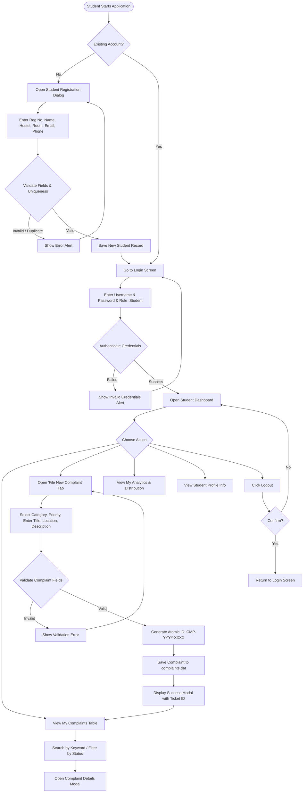

#### B. Administrator Lifecycle Workflow
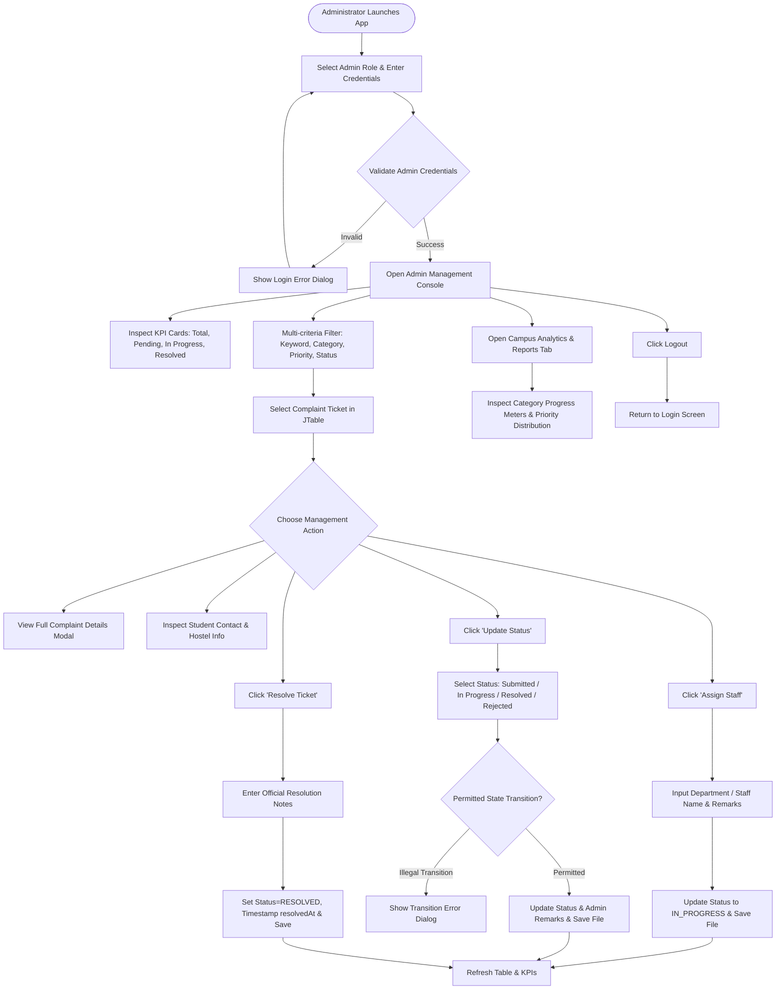

### 8.3 Use Case Diagram
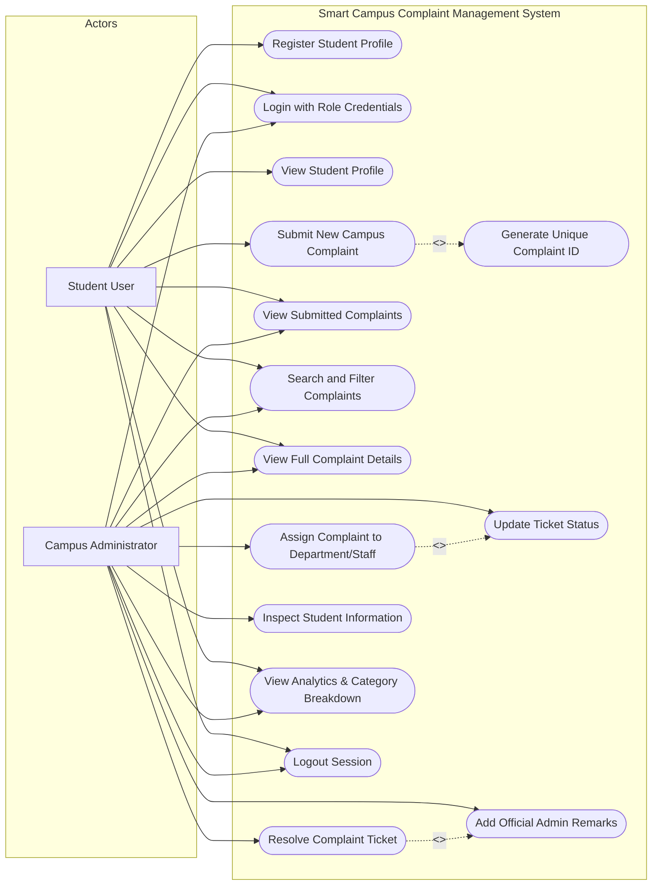

### 8.4 Sequence Diagrams

#### A. Complaint Submission Sequence
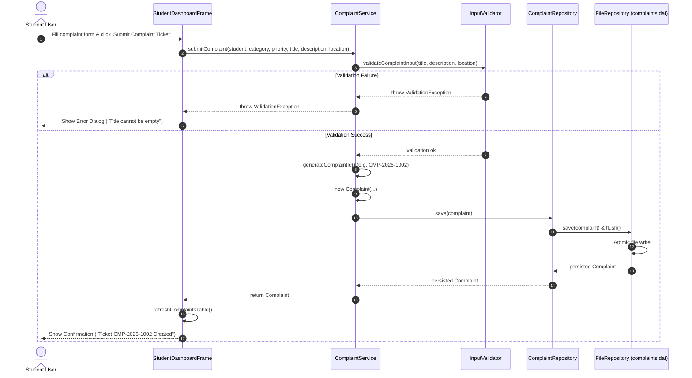

#### B. Admin Complaint Assignment & Resolution Sequence
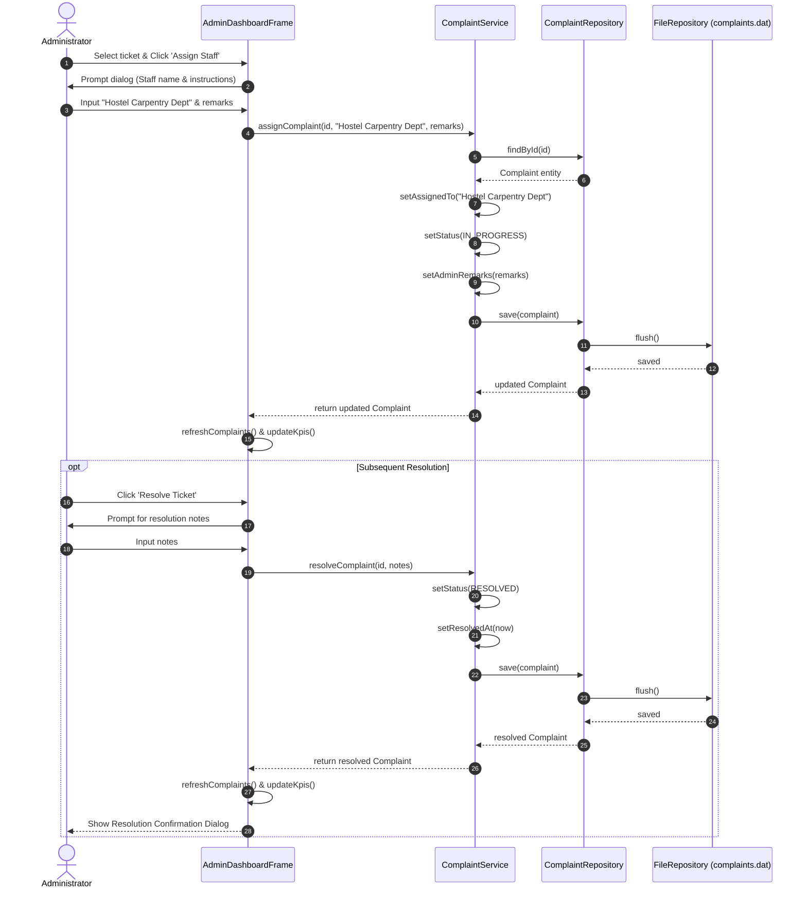

### 8.5 UML Class Diagram
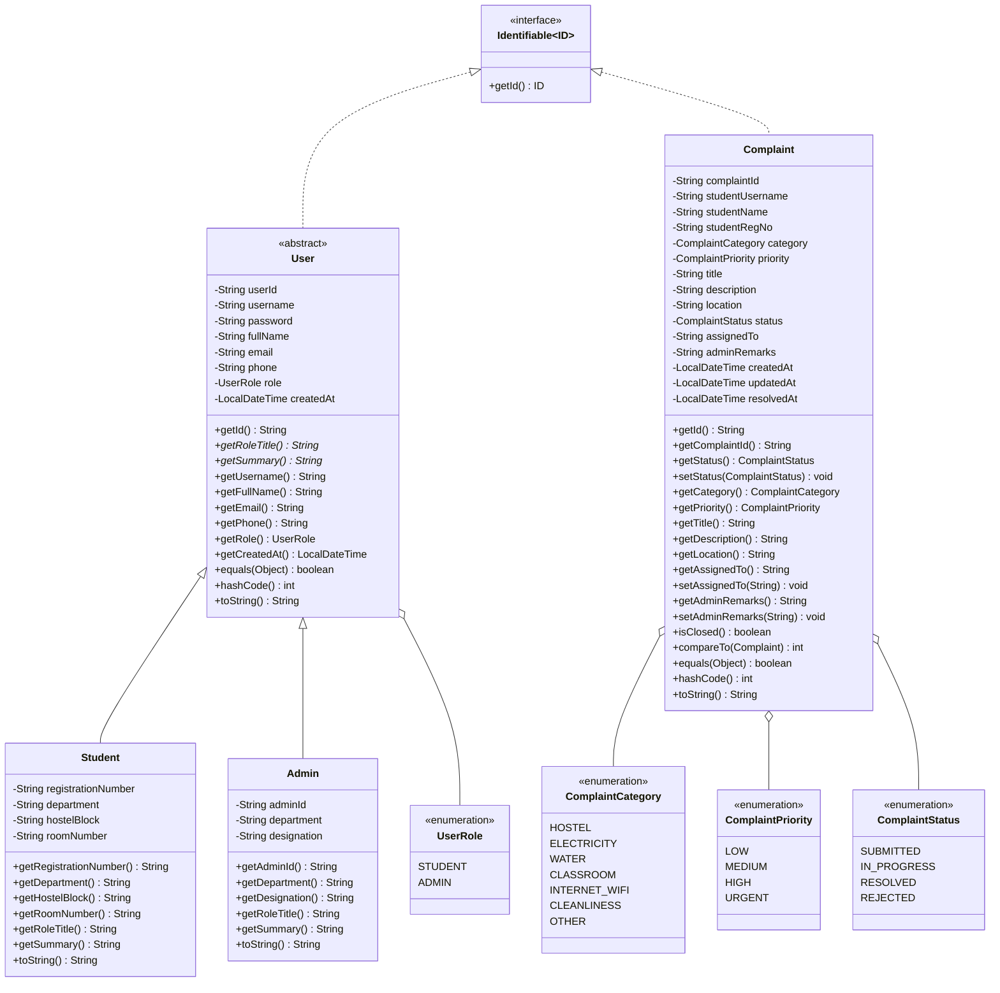

### 8.6 Storage Entity-Relationship (ER) Diagram
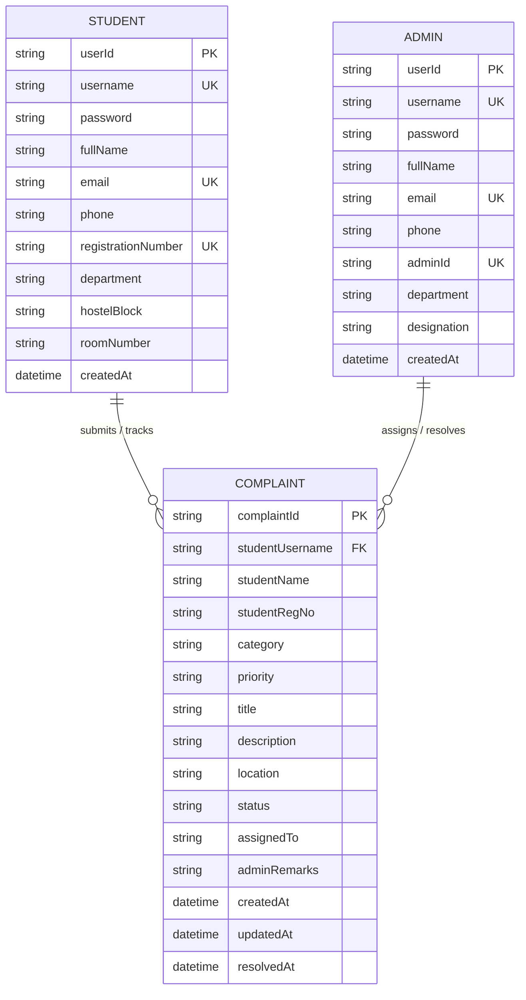


---

## 9. DESIGN DECISIONS AND RATIONALE

### Decision 1: Pure Java Object Serialization vs. External RDBMS
- **Rationale**: Academic evaluators and peer students running this project should not need to configure MySQL/PostgreSQL databases, create schemas, or install JDBC drivers. Java Object Serialization (`.dat`) offers 100% zero-configuration portability while preserving real disk persistence.

### Decision 2: Atomic File Write Pattern (`.tmp` to `.dat` Move)
- **Rationale**: Writing serialized streams directly to live data files risks corruption if the JVM terminates mid-write. By writing to a `.tmp` file and renaming atomically via `Files.move(..., ATOMIC_MOVE)`, storage is corruption-proof.

### Decision 3: Separation of User Roles via Class Inheritance
- **Rationale**: Both `Student` and `Admin` share common user properties (`userId`, `username`, `password`, `fullName`, `email`, `phone`, `role`, `createdAt`). Modeling `User` as an abstract base class demonstrates Java inheritance and polymorphism (`getRoleTitle()`, `getSummary()`).

### Decision 4: Custom Modern Swing Styling without Heavy External Dependencies
- **Rationale**: Relying on external third-party GUI libraries can cause classpath or dependency conflicts on different operating systems. Building a custom design system token class (`UITheme.java`) delivers custom card borders, color tokens, and table badges using standard Java Swing components.

---

## 10. IMPLEMENTATION DETAILS & JAVA CONCEPTS DEMONSTRATED

| Java Concept | Project File | Implementation Details |
| :--- | :--- | :--- |
| **Classes & Objects** | All `model/` classes | Encapsulated domain entities representing users, students, admins, and complaints. |
| **Encapsulation** | `User.java`, `Complaint.java` | Private fields with controlled public getters, setters, and validation guards. |
| **Inheritance** | `Student.java`, `Admin.java` | Extend abstract base class `User.java`, inheriting state and identity behaviors. |
| **Polymorphism** | `User.java`, `Repository.java` | Abstract template methods `getRoleTitle()`, generic CRUD repository methods. |
| **Abstraction & Interfaces** | `Identifiable.java`, `Repository.java` | Decouples business logic from specific storage implementations. |
| **Constructors** | `Student.java`, `Complaint.java` | Parameterized and default constructors with constructor chaining (`this(...)`). |
| **Method Overloading** | `ComplaintService.java` | 6 distinct overloaded signatures for `searchComplaints` and `getStudentComplaints`. |
| **Method Overriding** | Domain models | `@Override` of `toString()`, `equals()`, `hashCode()`, and `compareTo()`. |
| **Collections Framework** | Repositories & Services | `ArrayList`, `LinkedHashMap`, `Map`, and Java Streams (`Collectors.groupingBy`). |
| **Exception Handling** | `exception/` package | Structured `try-catch-finally`, `try-with-resources` ensuring stream closures. |
| **Custom Exceptions** | `ValidationException.java`, etc. | Specialized application exception hierarchy rooted in `ComplaintManagementException`. |
| **File I/O & Serialization** | `FileRepository.java` | `ObjectInputStream`, `ObjectOutputStream`, `BufferedOutputStream`, atomic moves. |
| **Date & Time API** | `DateTimeUtil.java` | Modern `java.time.LocalDateTime`, `DateTimeFormatter`, and duration calculations. |
| **Enums** | `model/*.java` | Strongly-typed enums with custom attributes, badge colors, and state logic. |
| **Modular Packages** | `src/` directory | Clean package separation into `model`, `service`, `repository`, `ui`, `util`, `main`. |
| **Input Validation** | `InputValidator.java` | RegEx patterns for email, 10-digit phone, VIT registration number format. |

---

## 11. SCREENSHOTS & RESULTS WALKTHROUGH

Actual screenshots rendered directly from the live Java Swing components:

### 11.1 Welcome & Secure Login Screen
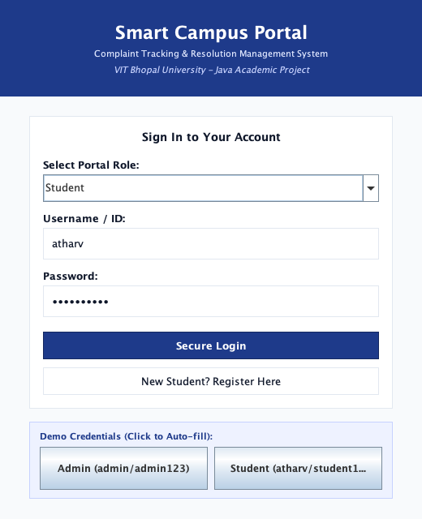
*Figure 1: Welcome portal with role selector (Student/Admin), secure credential inputs, registration link, and demo credential quick-fill shortcuts.*

### 11.2 Student Self-Registration Dialog
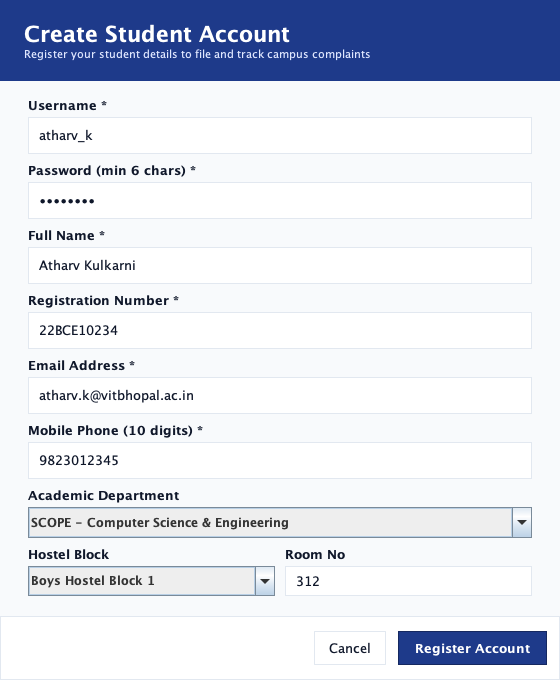
*Figure 2: Registration modal with comprehensive input validation for registration numbers, emails, phone numbers, and hostel blocks.*

### 11.3 Student Dashboard - My Complaints & Tracking
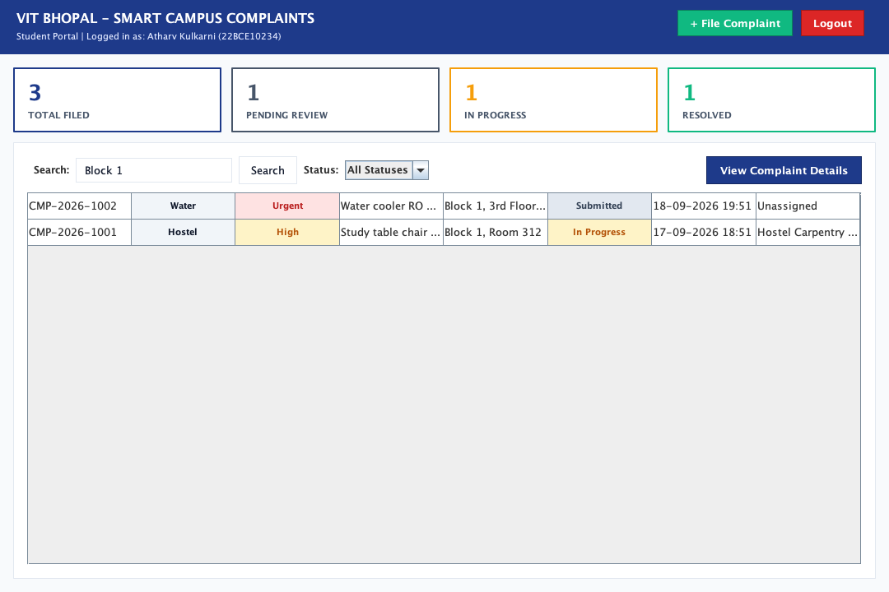
*Figure 3: Student tracking portal displaying summary KPI cards, search bar, status filter, and JTable with colored status badges.*

### 11.4 Submit Campus Complaint Screen
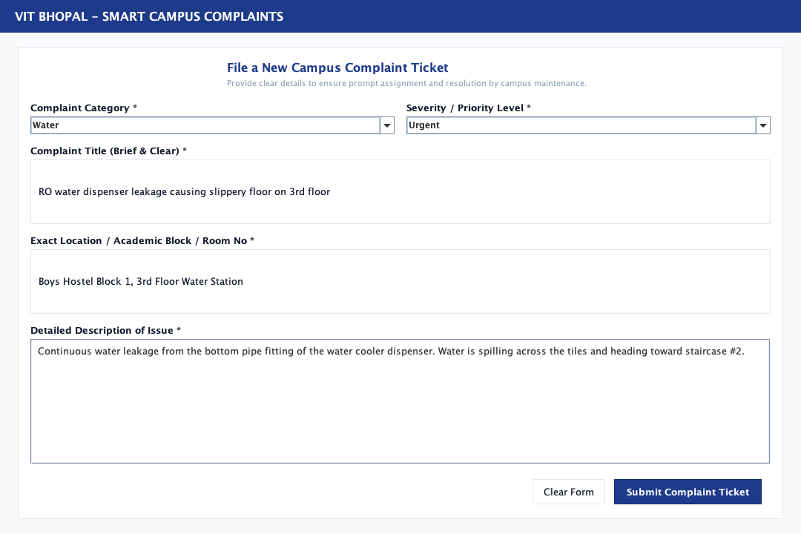
*Figure 4: Complaint submission form featuring 7 campus categories, 4 severity priority levels, location input, and detailed description.*

### 11.5 Complaint Inspection Details Modal
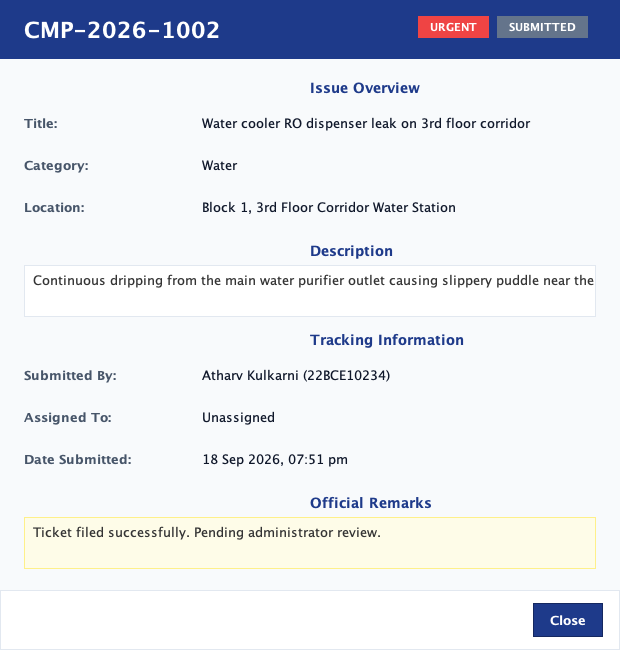
*Figure 5: Ticket inspection dialog showing issue overview, tracking timestamps, assigned staff, and official administration remarks.*

### 11.6 Administrator Management Console
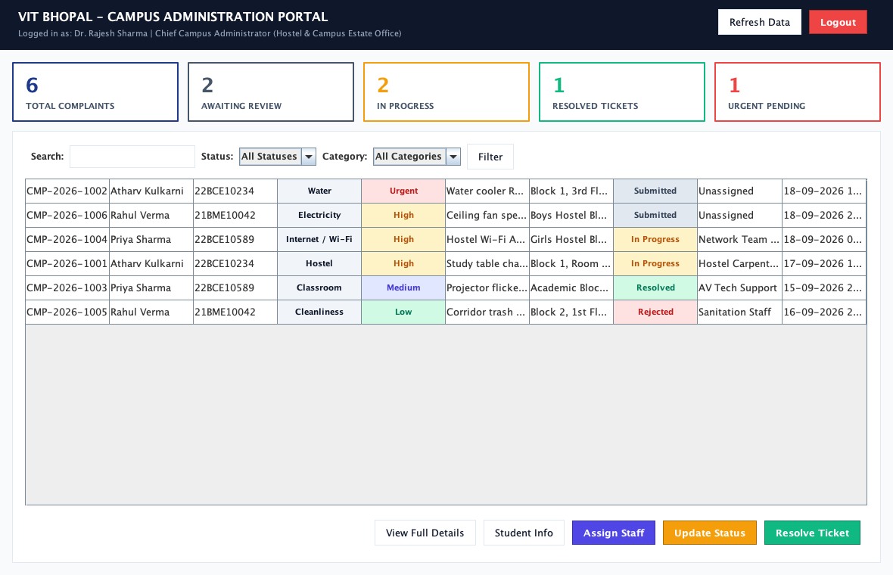
*Figure 6: Administrator console displaying system-wide KPIs, multi-criteria filters, complaints table, and work order assignment controls.*

### 11.7 Campus Analytics & KPI Reports
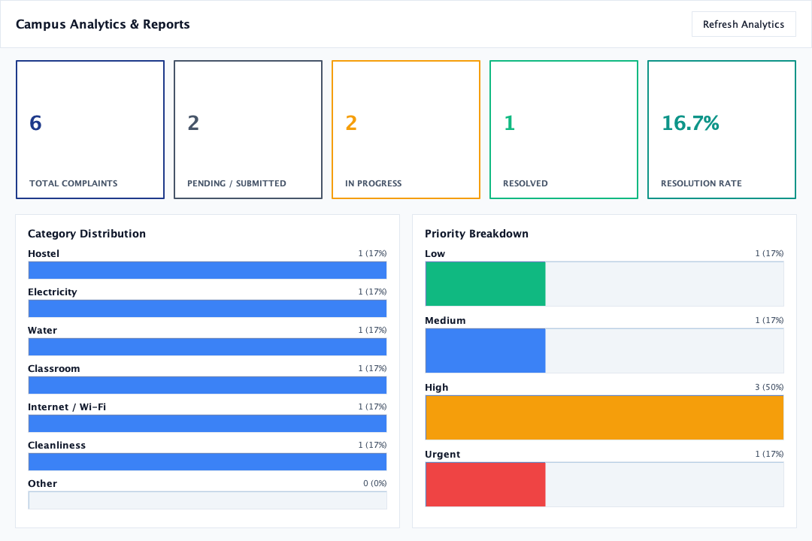
*Figure 7: Real-time analytics dashboard presenting status counts, resolution rate KPI (%), category breakdown meters, and priority distribution.*

---

## 12. TESTING APPROACH

The project was validated using a multi-tiered testing methodology:
1. **Domain Unit Testing**: Verification of business logic, regular expressions, and calculation rules in isolation.
2. **Persistence Lifecycle Testing**: Verifying that records saved by one repository instance successfully reload and update in separate instances across file storage.
3. **Workflow Integration Testing**: Simulating end-to-end user flows: student registration $\rightarrow$ login $\rightarrow$ submission $\rightarrow$ admin assignment $\rightarrow$ resolution $\rightarrow$ report aggregation.
4. **Standalone Test Runner**: A dedicated CLI test runner (`TestSuiteRunner.java`) executing 28 automated test cases with millisecond timing and formatted terminal output.

---

## 13. TEST CASES AND RESULTS

All 28 automated test cases executed with a **100% Pass Rate**:

| # | Test Case Description | Expected Result | Actual Result | Status |
| :-: | :--- | :--- | :--- | :-: |
| 1 | InputValidator: Valid email passes | Validation succeeds | No exception thrown | **PASS** |
| 2 | InputValidator: Malformed email throws ValidationException | ValidationException thrown | Error message caught | **PASS** |
| 3 | InputValidator: Valid 10-digit mobile passes | Validation succeeds | Phone accepted | **PASS** |
| 4 | InputValidator: 5-digit phone throws ValidationException | ValidationException thrown | Error message caught | **PASS** |
| 5 | InputValidator: Valid registration number passes | Validation succeeds | RegNo accepted | **PASS** |
| 6 | InputValidator: Short reg number throws ValidationException | ValidationException thrown | Error message caught | **PASS** |
| 7 | InputValidator: Valid complaint input passes | Validation succeeds | Input accepted | **PASS** |
| 8 | InputValidator: Empty title throws ValidationException | ValidationException thrown | Error message caught | **PASS** |
| 9 | AuthService: Student registration creates record | Student record created | Student object saved | **PASS** |
| 10 | AuthService: Duplicate username throws DuplicateResourceException | Duplicate exception thrown | Conflict caught | **PASS** |
| 11 | AuthService: Duplicate reg number throws DuplicateResourceException | Duplicate exception thrown | Conflict caught | **PASS** |
| 12 | AuthService: Student login with valid credentials succeeds | Student session created | Authenticated session | **PASS** |
| 13 | AuthService: Bad password throws AuthenticationException | AuthenticationException | Login rejected | **PASS** |
| 14 | AuthService: Admin login with valid credentials succeeds | Admin session verified | Admin authenticated | **PASS** |
| 15 | AuthService: Logout resets session state to null | Session cleared | User is null | **PASS** |
| 16 | ComplaintService: Submission generates unique CMP-YYYY-XXXX ID | CMP-YYYY-XXXX format | CMP-2026-1001 | **PASS** |
| 17 | ComplaintService: Subsequent complaints increment sequence | Sequential IDs generated | CMP-2026-1001 $\rightarrow$ 1002 | **PASS** |
| 18 | ComplaintService: Valid transition SUBMITTED $\rightarrow$ IN_PROGRESS | Status updated | IN_PROGRESS | **PASS** |
| 19 | ComplaintService: Invalid transition RESOLVED $\rightarrow$ REJECTED throws | ValidationException | Transition blocked | **PASS** |
| 20 | ComplaintService: Assignment sets staff & sets IN_PROGRESS | Staff set, status updated | Staff assigned | **PASS** |
| 21 | ComplaintService: Resolving complaint sets timestamp | Status RESOLVED & timestamp | Timestamp populated | **PASS** |
| 22 | ComplaintService: Search finds complaints by partial title | Matching complaint returned | Keyword match found | **PASS** |
| 23 | ComplaintService: Multi-criteria filter by cat, pri, status | Single matching ticket | Urgent Hostel ticket | **PASS** |
| 24 | FileRepository: Entities persist and reload across instances | Record reloaded from file | Record verified | **PASS** |
| 25 | FileRepository: Entity modification updates record on disk | Updated room verified | Room 505 verified | **PASS** |
| 26 | FileRepository: Deletion removes record from storage | Record deleted | Count = 0 | **PASS** |
| 27 | ReportService: Accurately calculates counts & resolution rate | Total=4, Resolved=2, 50.0% | Total=4, Resolved=2, 50.0% | **PASS** |
| 28 | ReportService: Category and priority distribution completeness | All enum keys present | All 7 categories mapped | **PASS** |

---

## 14. CHALLENGES FACED & ENGINEERING SOLUTIONS

1. **Challenge: Preventing Data Corruption During File Writing**
   - *Problem*: Directly writing serialized objects to a file can lead to unrecoverable data corruption if the user forcibly terminates the application while the file stream is open.
   - *Solution*: Designed an atomic write-and-rename pattern in `FileRepository.java` using temporary files (`.dat.tmp`) and `Files.move(..., StandardCopyOption.ATOMIC_MOVE)`.

2. **Challenge: Cross-Platform Swing GUI Aesthetics**
   - *Problem*: Default Java Swing components look dated on modern high-resolution displays.
   - *Solution*: Developed a dedicated `UITheme` class with curated hex colors, anti-aliased font rendering hints, custom border compounds, and table badge cell renderers.

3. **Challenge: Thread-Safe Unique Complaint Identifier Generation**
   - *Problem*: Generating unique sequential IDs in format `CMP-YYYY-XXXX` across application restarts could lead to collisions if counters reset to 1.
   - *Solution*: Implemented an intelligent scanner in `ComplaintService.java` that inspects existing records on startup, determines the current maximum sequence number, and initializes an `AtomicInteger` to ensure uninterrupted sequential incrementation.

---

## 15. LEARNINGS AND KEY TAKEAWAYS
- **Object-Oriented Design in Practice**: Applying Inheritance and Polymorphism (`User` $\rightarrow$ `Student`, `Admin`) reduced duplicate code and streamlined authentication and session management.
- **Architectural Discipline**: Keeping Presentation, Service, and Repository layers strictly decoupled simplified testing and isolated bugs.
- **Defensive Programming**: Validating inputs at both the UI boundary and service layers prevented malformed state from reaching persistence files.
- **Java Streams & Collections**: Utilizing Java Streams (`groupingBy`, `counting`) made analytics aggregation clean, declarative, and efficient.

---

## 16. FUTURE ENHANCEMENTS
- **Automated SLA Escalation**: Email or desktop push notifications when an urgent complaint remains in `SUBMITTED` state for over 24 hours.
- **Photo / Document Attachment**: Allowing students to attach image files or repair invoices to complaints.
- **PDF Report Generation**: Exporting official campus maintenance audit reports to formatted PDF documents.
- **Student Feedback & Rating**: Allowing students to submit a 1–5 star rating and feedback upon ticket resolution.

---

## 17. REFERENCES
1. Bloch, Joshua. *Effective Java (3rd Edition)*. Addison-Wesley Professional, 2018.
2. Oracle Java SE 17 Documentation: [https://docs.oracle.com/en/java/javase/17/](https://docs.oracle.com/en/java/javase/17/)
3. Java Swing API Specification: [https://docs.oracle.com/javase/tutorial/uiswing/](https://docs.oracle.com/javase/tutorial/uiswing/)
4. VIT Bhopal University Academic Regulations & VITyarthi Project Guidelines.
