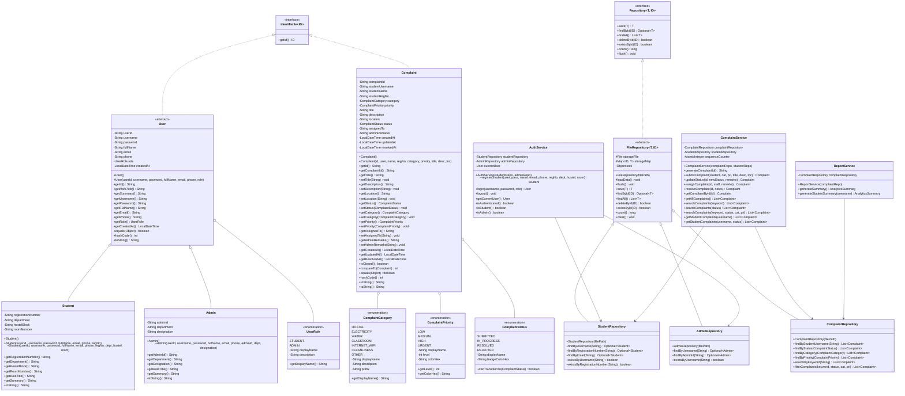

# Class Diagram: Smart Campus Complaint Management System

```mermaid
classDiagram
    %% Core Domain Interfaces & Base Classes
    class Identifiable~ID~ {
        <<interface>>
        +getId() ID
    }

    class User {
        <<abstract>>
        -String userId
        -String username
        -String password
        -String fullName
        -String email
        -String phone
        -UserRole role
        -LocalDateTime createdAt
        +User()
        +User(userId, username, password, fullName, email, phone, role)
        +getId() String
        +getRoleTitle()* String
        +getSummary()* String
        +getUsername() String
        +getPassword() String
        +getFullName() String
        +getEmail() String
        +getPhone() String
        +getRole() UserRole
        +getCreatedAt() LocalDateTime
        +equals(Object) boolean
        +hashCode() int
        +toString() String
    }

    class Student {
        -String registrationNumber
        -String department
        -String hostelBlock
        -String roomNumber
        +Student()
        +Student(userId, username, password, fullName, email, phone, regNo)
        +Student(userId, username, password, fullName, email, phone, regNo, dept, hostel, room)
        +getRegistrationNumber() String
        +getDepartment() String
        +getHostelBlock() String
        +getRoomNumber() String
        +getRoleTitle() String
        +getSummary() String
        +toString() String
    }

    class Admin {
        -String adminId
        -String department
        -String designation
        +Admin()
        +Admin(userId, username, password, fullName, email, phone, adminId, dept, designation)
        +getAdminId() String
        +getDepartment() String
        +getDesignation() String
        +getRoleTitle() String
        +getSummary() String
        +toString() String
    }

    class Complaint {
        -String complaintId
        -String studentUsername
        -String studentName
        -String studentRegNo
        -ComplaintCategory category
        -ComplaintPriority priority
        -String title
        -String description
        -String location
        -ComplaintStatus status
        -String assignedTo
        -String adminRemarks
        -LocalDateTime createdAt
        -LocalDateTime updatedAt
        -LocalDateTime resolvedAt
        +Complaint()
        +Complaint(id, user, name, regNo, category, priority, title, desc, loc)
        +getId() String
        +getComplaintId() String
        +getTitle() String
        +setTitle(String) void
        +getDescription() String
        +setDescription(String) void
        +getLocation() String
        +setLocation(String) void
        +getStatus() ComplaintStatus
        +setStatus(ComplaintStatus) void
        +getCategory() ComplaintCategory
        +setCategory(ComplaintCategory) void
        +getPriority() ComplaintPriority
        +setPriority(ComplaintPriority) void
        +getAssignedTo() String
        +setAssignedTo(String) void
        +getAdminRemarks() String
        +setAdminRemarks(String) void
        +getCreatedAt() LocalDateTime
        +getUpdatedAt() LocalDateTime
        +getResolvedAt() LocalDateTime
        +isClosed() boolean
        +compareTo(Complaint) int
        +equals(Object) boolean
        +hashCode() int
        +toString() String
        +toString() String
    }

    %% Enums
    class UserRole {
        <<enumeration>>
        STUDENT
        ADMIN
        -String displayName
        -String description
        +getDisplayName() String
    }

    class ComplaintCategory {
        <<enumeration>>
        HOSTEL
        ELECTRICITY
        WATER
        CLASSROOM
        INTERNET_WIFI
        CLEANLINESS
        OTHER
        -String displayName
        -String description
        -String prefix
        +getDisplayName() String
    }

    class ComplaintPriority {
        <<enumeration>>
        LOW
        MEDIUM
        HIGH
        URGENT
        -String displayName
        -int level
        -String colorHex
        +getLevel() int
        +getColorHex() String
    }

    class ComplaintStatus {
        <<enumeration>>
        SUBMITTED
        IN_PROGRESS
        RESOLVED
        REJECTED
        -String displayName
        -String badgeColorHex
        +canTransitionTo(ComplaintStatus) boolean
    }

    %% Repositories
    class Repository~T, ID~ {
        <<interface>>
        +save(T) T
        +findById(ID) Optional~T~
        +findAll() List~T~
        +deleteById(ID) boolean
        +existsById(ID) boolean
        +count() long
        +flush() void
    }

    class FileRepository~T, ID~ {
        <<abstract>>
        #File storageFile
        #Map~ID, T~ storageMap
        -Object lock
        +FileRepository(filePath)
        #loadData() void
        +flush() void
        +save(T) T
        +findById(ID) Optional~T~
        +findAll() List~T~
        +deleteById(ID) boolean
        +existsById(ID) boolean
        +count() long
        +clear() void
    }

    class StudentRepository {
        +StudentRepository(filePath)
        +findByUsername(String) Optional~Student~
        +findByRegistrationNumber(String) Optional~Student~
        +findByEmail(String) Optional~Student~
        +existsByUsername(String) boolean
        +existsByRegistrationNumber(String) boolean
    }

    class AdminRepository {
        +AdminRepository(filePath)
        +findByUsername(String) Optional~Admin~
        +findByAdminId(String) Optional~Admin~
        +existsByUsername(String) boolean
    }

    class ComplaintRepository {
        +ComplaintRepository(filePath)
        +findByStudentUsername(String) List~Complaint~
        +findByStatus(ComplaintStatus) List~Complaint~
        +findByCategory(ComplaintCategory) List~Complaint~
        +findByPriority(ComplaintPriority) List~Complaint~
        +searchByKeyword(String) List~Complaint~
        +filterComplaints(keyword, status, cat, pri) List~Complaint~
    }

    %% Services
    class AuthService {
        -StudentRepository studentRepository
        -AdminRepository adminRepository
        -User currentUser
        +AuthService(studentRepo, adminRepo)
        +registerStudent(user, pass, name, email, phone, regNo, dept, hostel, room) Student
        +login(username, password, role) User
        +logout() void
        +getCurrentUser() User
        +isAuthenticated() boolean
        +isStudent() boolean
        +isAdmin() boolean
    }

    class ComplaintService {
        -ComplaintRepository complaintRepository
        -StudentRepository studentRepository
        -AtomicInteger sequenceCounter
        +ComplaintService(complaintRepo, studentRepo)
        +generateComplaintId() String
        +submitComplaint(student, cat, pri, title, desc, loc) Complaint
        +updateStatus(id, newStatus, remarks) Complaint
        +assignComplaint(id, staff, remarks) Complaint
        +resolveComplaint(id, notes) Complaint
        +getComplaintById(id) Complaint
        +getAllComplaints() List~Complaint~
        +searchComplaints(keyword) List~Complaint~
        +searchComplaints(status) List~Complaint~
        +searchComplaints(keyword, status, cat, pri) List~Complaint~
        +getStudentComplaints(username) List~Complaint~
        +getStudentComplaints(username, status) List~Complaint~
    }

    class ReportService {
        -ComplaintRepository complaintRepository
        +ReportService(complaintRepo)
        +generateSummary() AnalyticsSummary
        +generateStudentSummary(username) AnalyticsSummary
    }

    %% Inheritance & Realization Relationships
    Identifiable <|.. User
    Identifiable <|.. Complaint
    User <|-- Student
    User <|-- Admin
    User o-- UserRole
    Complaint o-- ComplaintCategory
    Complaint o-- ComplaintPriority
    Complaint o-- ComplaintStatus

    Repository <|.. FileRepository
    FileRepository <|-- StudentRepository
    FileRepository <|-- AdminRepository
    FileRepository <|-- ComplaintRepository

    AuthService --> StudentRepository
    AuthService --> AdminRepository
    ComplaintService --> ComplaintRepository
    ComplaintService --> StudentRepository
    ReportService --> ComplaintRepository
```
