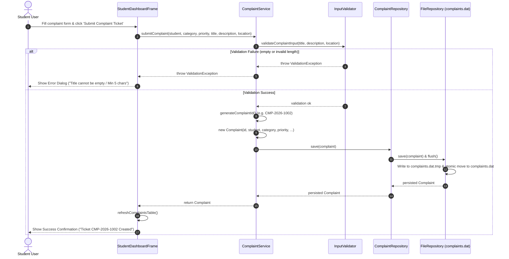
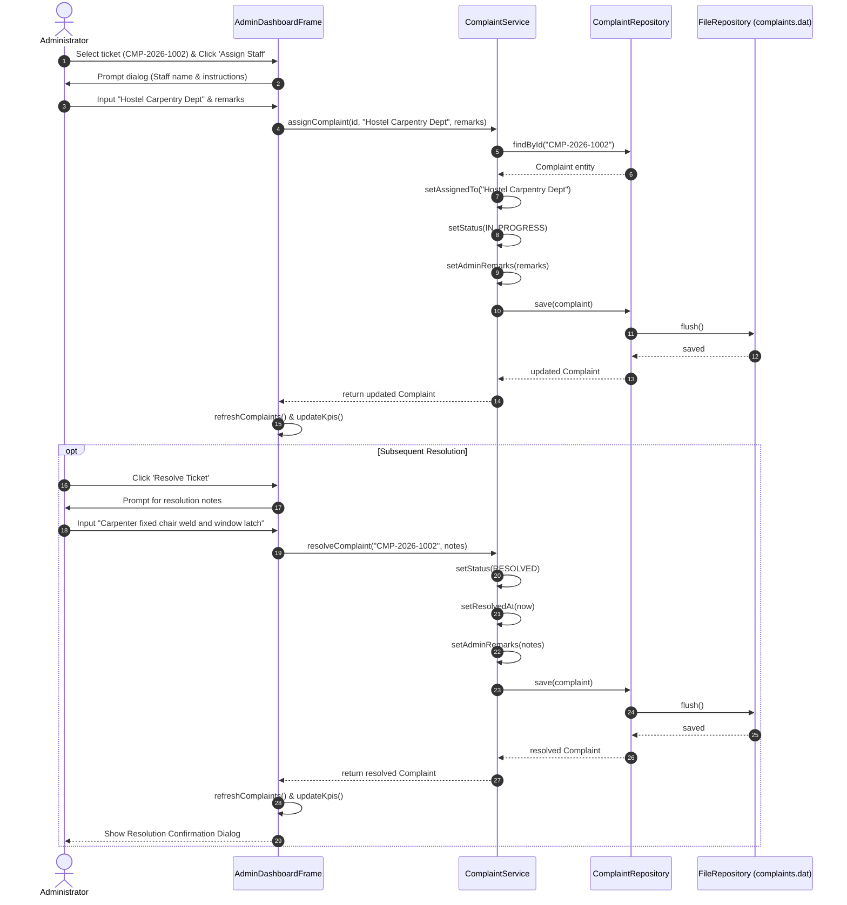

# Sequence Diagrams: Smart Campus Complaint Management System

## 1. Sequence Diagram: Student Complaint Submission

```mermaid
sequenceDiagram
    autonumber
    actor Student as Student User
    participant View as StudentDashboardFrame
    participant Service as ComplaintService
    participant Validator as InputValidator
    participant Repo as ComplaintRepository
    participant Storage as FileRepository (complaints.dat)

    Student ->> View: Fill complaint form & click 'Submit Complaint Ticket'
    View ->> Service: submitComplaint(student, category, priority, title, description, location)
    
    Service ->> Validator: validateComplaintInput(title, description, location)
    alt Validation Failure (empty or invalid length)
        Validator -->> Service: throw ValidationException
        Service -->> View: throw ValidationException
        View -->> Student: Show Error Dialog ("Title cannot be empty / Min 5 chars")
    else Validation Success
        Validator -->> Service: validation ok
        
        Service ->> Service: generateComplaintId() (e.g. CMP-2026-1002)
        Service ->> Service: new Complaint(id, student, category, priority, ...)
        
        Service ->> Repo: save(complaint)
        Repo ->> Storage: save(complaint) & flush()
        Storage ->> Storage: Write to complaints.dat.tmp & atomic move to complaints.dat
        Storage -->> Repo: persisted Complaint
        Repo -->> Service: persisted Complaint
        
        Service -->> View: return Complaint
        View ->> View: refreshComplaintsTable()
        View -->> Student: Show Success Confirmation ("Ticket CMP-2026-1002 Created")
    end
```

---

## 2. Sequence Diagram: Admin Complaint Assignment & Resolution

```mermaid
sequenceDiagram
    autonumber
    actor Admin as Administrator
    participant View as AdminDashboardFrame
    participant Service as ComplaintService
    participant Repo as ComplaintRepository
    participant Storage as FileRepository (complaints.dat)

    Admin ->> View: Select ticket (CMP-2026-1002) & Click 'Assign Staff'
    View ->> Admin: Prompt dialog (Staff name & instructions)
    Admin ->> View: Input "Hostel Carpentry Dept" & remarks
    
    View ->> Service: assignComplaint(id, "Hostel Carpentry Dept", remarks)
    Service ->> Repo: findById("CMP-2026-1002")
    Repo -->> Service: Complaint entity
    Service ->> Service: setAssignedTo("Hostel Carpentry Dept")
    Service ->> Service: setStatus(IN_PROGRESS)
    Service ->> Service: setAdminRemarks(remarks)
    Service ->> Repo: save(complaint)
    Repo ->> Storage: flush()
    Storage -->> Repo: saved
    Repo -->> Service: updated Complaint
    Service -->> View: return updated Complaint
    View ->> View: refreshComplaints() & updateKpis()

    opt Subsequent Resolution
        Admin ->> View: Click 'Resolve Ticket'
        View ->> Admin: Prompt for resolution notes
        Admin ->> View: Input "Carpenter fixed chair weld and window latch"
        View ->> Service: resolveComplaint("CMP-2026-1002", notes)
        Service ->> Service: setStatus(RESOLVED)
        Service ->> Service: setResolvedAt(now)
        Service ->> Service: setAdminRemarks(notes)
        Service ->> Repo: save(complaint)
        Repo ->> Storage: flush()
        Storage -->> Repo: saved
        Repo -->> Service: resolved Complaint
        Service -->> View: return resolved Complaint
        View ->> View: refreshComplaints() & updateKpis()
        View -->> Admin: Show Resolution Confirmation Dialog
    end
```
