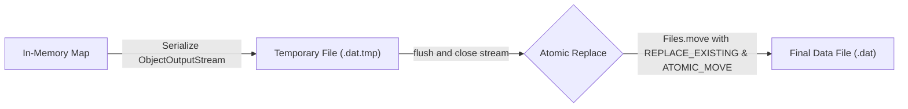
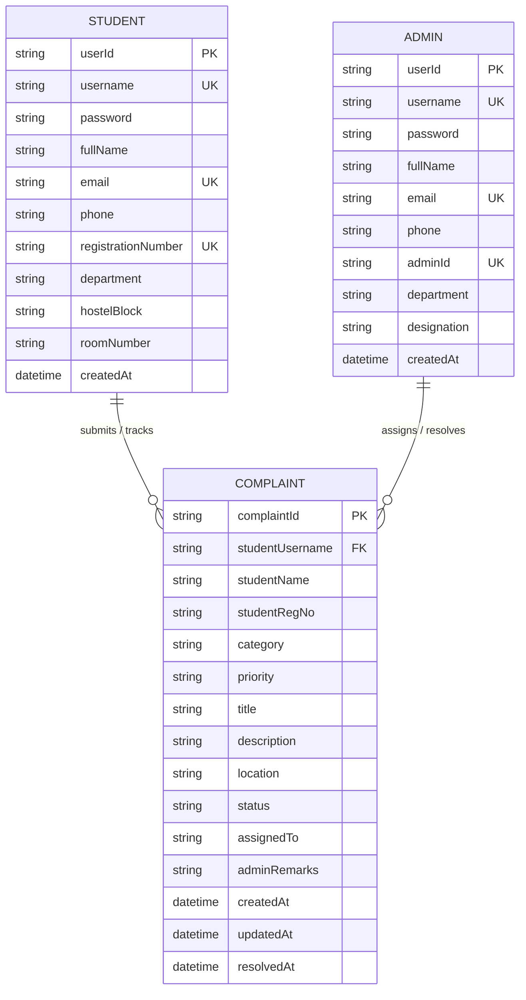

# Storage and Data Design Document: Smart Campus Complaint Management System

## 1. Storage Architecture Overview
The application uses a self-contained, file-based persistence model relying on **Java Object Serialization**. This design satisfies the core academic requirement of avoiding heavy external database engines (such as MySQL or PostgreSQL), ensuring zero-configuration portability for evaluators.

```
data/
├── students.dat       (Serialized Map<String, Student>)
├── admins.dat         (Serialized Map<String, Admin>)
└── complaints.dat     (Serialized Map<String, Complaint>)
```

---

## 2. Serialization Schema & Data Entities

### 2.1 Student Records (`students.dat`)
- **Key**: `student.getUsername().toLowerCase()` (Unique String)
- **Value**: `model.Student` object
```
Student Entity
├── userId             : String (e.g. "STU-A1B2C3D4")
├── username           : String (e.g. "atharv")
├── password           : String (Plaintext/Hashed credentials)
├── fullName           : String (e.g. "Atharv Kulkarni")
├── email              : String (e.g. "atharv.k@vitbhopal.ac.in")
├── phone              : String (e.g. "9823012345")
├── role               : UserRole.STUDENT
├── registrationNumber : String (e.g. "22BCE10234")
├── department         : String (e.g. "SCOPE - Computer Science")
├── hostelBlock        : String (e.g. "Boys Hostel Block 1")
├── roomNumber         : String (e.g. "312")
└── createdAt          : LocalDateTime
```

### 2.2 Administrator Records (`admins.dat`)
- **Key**: `admin.getUsername().toLowerCase()` (Unique String)
- **Value**: `model.Admin` object
```
Admin Entity
├── userId             : String (e.g. "ADM-1001")
├── username           : String (e.g. "admin")
├── password           : String (e.g. "admin123")
├── fullName           : String (e.g. "Dr. Rajesh Sharma")
├── email              : String (e.g. "admin@vitbhopal.ac.in")
├── phone              : String (e.g. "9876543210")
├── role               : UserRole.ADMIN
├── adminId            : String (e.g. "ADM-001")
├── department         : String (e.g. "Hostel & Campus Estate Office")
├── designation        : String (e.g. "Chief Campus Administrator")
└── createdAt          : LocalDateTime
```

### 2.3 Complaint Records (`complaints.dat`)
- **Key**: `complaint.getComplaintId()` (Unique String, format: `CMP-YYYY-XXXX`)
- **Value**: `model.Complaint` object
```
Complaint Entity
├── complaintId        : String (e.g. "CMP-2026-1001")
├── studentUsername    : String (e.g. "atharv")
├── studentName        : String (e.g. "Atharv Kulkarni")
├── studentRegNo       : String (e.g. "22BCE10234")
├── category           : ComplaintCategory (HOSTEL, ELECTRICITY, WATER, etc.)
├── priority           : ComplaintPriority (LOW, MEDIUM, HIGH, URGENT)
├── title              : String (Max 100 chars)
├── description        : String (Max 1000 chars)
├── location           : String (e.g. "Block 1, Room 312")
├── status             : ComplaintStatus (SUBMITTED, IN_PROGRESS, RESOLVED, REJECTED)
├── assignedTo         : String (e.g. "Hostel Carpentry Dept")
├── adminRemarks       : String (Official notes)
├── createdAt          : LocalDateTime
├── updatedAt          : LocalDateTime
└── resolvedAt         : LocalDateTime (Nullable)
```

---

## 3. Data Reliability & Atomic File Persistence Pattern

To prevent data corruption in the event of unexpected application termination or power failure, `FileRepository<T, ID>` implements an **Atomic Save Pattern**:



1. **In-Memory Cache**: A `LinkedHashMap<ID, T>` maintains entities in memory for high-speed, instant query execution without redundant disk reads.
2. **Synchronized Critical Sections**: All write and delete mutations synchronize on a private monitor lock object (`private final Object lock = new Object();`).
3. **Atomic File Replacement**: When `flush()` is invoked, serialized bytes are written completely to a temporary `.tmp` file. Only after the stream is safely closed is the file atomically moved to the destination `.dat` file using `java.nio.file.Files.move(..., StandardCopyOption.ATOMIC_MOVE)`.
4. **Resilient Initialization**: If any storage file is missing upon startup, the system automatically creates the parent directory and initializes an empty collection, seamlessly populated by `DataInitializer`.

---

## 4. Entity-Relationship (ER) Diagram

The logical entity relationships between Students, Administrators, and Complaints are modeled below:



