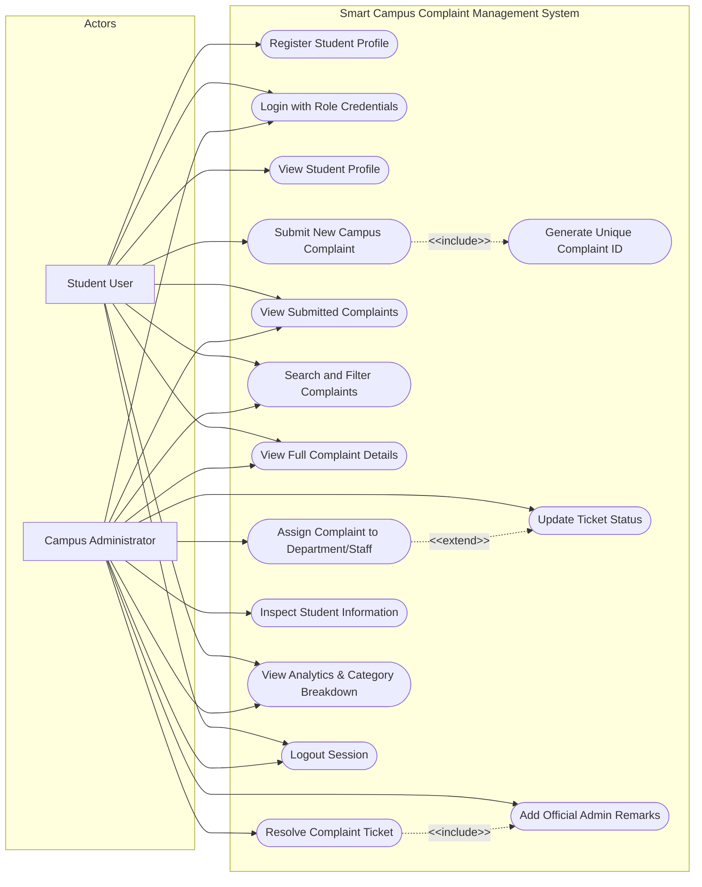

# Use Case Diagram: Smart Campus Complaint Management System

### Use Case Specifications

| Use Case ID | Name | Primary Actor | Description |
| :--- | :--- | :--- | :--- |
| **UC-01** | Register Profile | Student | Enters registration number, contact, and hostel room to register. |
| **UC-02** | Login | Student / Admin | Validates credentials against serialized file store. |
| **UC-04** | Submit Complaint | Student | Files new maintenance ticket; validates non-empty and length constraints. |
| **UC-05** | Generate ID | System (Service) | Auto-assigns sequential formatted ID `CMP-YYYY-XXXX`. |
| **UC-07** | Search & Filter | Student / Admin | Filters complaints by keyword, category, status, and priority. |
| **UC-09** | Assign Staff | Admin | Allocates ticket to department or staff, moving status to `IN_PROGRESS`. |
| **UC-10** | Update Status | Admin | Advances status while validating permissible state transitions. |
| **UC-12** | Resolve Ticket | Admin | Marks ticket `RESOLVED`, adds resolution remarks, and timestamps completion. |
| **UC-14** | View Analytics | Student / Admin | Displays KPI metrics, category distribution meters, and resolution rates. |
