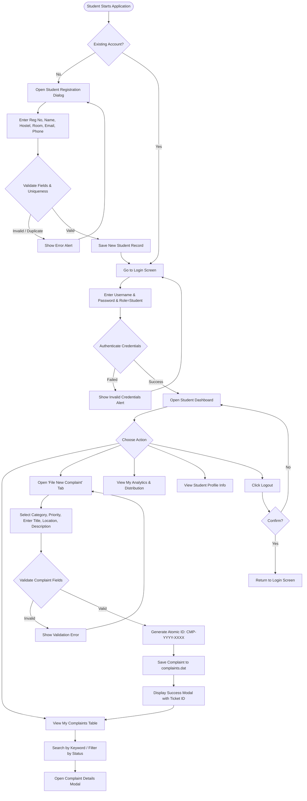
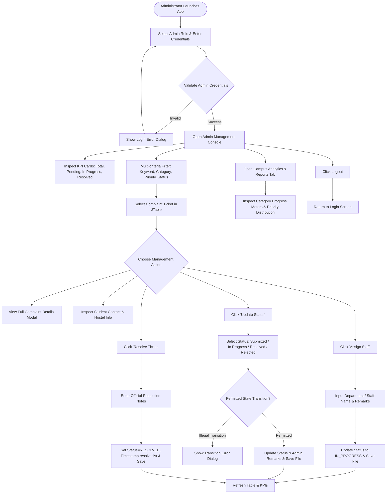

# Process Workflow Diagrams: Smart Campus Complaint Management System

## 1. Student User Workflow

```mermaid
flowchart TD
    S_START([Student Starts Application]) --> S_LOGIN_DEC{Existing Account?}
    
    S_LOGIN_DEC -- No --> S_REG[Open Student Registration Dialog]
    S_REG --> S_INPUT_REG[Enter Reg No, Name, Hostel, Room, Email, Phone]
    S_INPUT_REG --> S_VAL_REG{Validate Fields & Uniqueness}
    S_VAL_REG -- Invalid / Duplicate --> S_ERR_REG[Show Error Alert] --> S_REG
    S_VAL_REG -- Valid --> S_SAVE_REG[Save New Student Record] --> S_LOGIN[Go to Login Screen]

    S_LOGIN_DEC -- Yes --> S_LOGIN
    S_LOGIN --> S_ENTER_CRED[Enter Username & Password & Role=Student]
    S_ENTER_CRED --> S_AUTH{Authenticate Credentials}
    S_AUTH -- Failed --> S_AUTH_ERR[Show Invalid Credentials Alert] --> S_LOGIN
    S_AUTH -- Success --> S_DASH[Open Student Dashboard]

    S_DASH --> S_OPT{Choose Action}
    
    S_OPT --> S_VIEW[View My Complaints Table]
    S_VIEW --> S_SEARCH[Search by Keyword / Filter by Status]
    S_SEARCH --> S_DETAILS[Open Complaint Details Modal]
    
    S_OPT --> S_SUBMIT[Open 'File New Complaint' Tab]
    S_SUBMIT --> S_ENTER_COMP[Select Category, Priority, Enter Title, Location, Description]
    S_ENTER_COMP --> S_VAL_COMP{Validate Complaint Fields}
    S_VAL_COMP -- Invalid --> S_ERR_COMP[Show Validation Error] --> S_SUBMIT
    S_VAL_COMP -- Valid --> S_GEN_ID[Generate Atomic ID: CMP-YYYY-XXXX]
    S_GEN_ID --> S_SAVE_COMP[Save Complaint to complaints.dat]
    S_SAVE_COMP --> S_CONFIRM[Display Success Modal with Ticket ID]
    S_CONFIRM --> S_VIEW

    S_OPT --> S_ANALYTICS[View My Analytics & Distribution]
    S_OPT --> S_PROFILE[View Student Profile Info]
    S_OPT --> S_LOGOUT[Click Logout] --> S_CONFIRM_LOGOUT{Confirm?}
    S_CONFIRM_LOGOUT -- Yes --> S_RETURN_LOGIN[Return to Login Screen]
    S_CONFIRM_LOGOUT -- No --> S_DASH
```

---

## 2. Administrator Workflow

```mermaid
flowchart TD
    A_START([Administrator Launches App]) --> A_LOGIN[Select Admin Role & Enter Credentials]
    A_LOGIN --> A_AUTH{Validate Admin Credentials}
    A_AUTH -- Invalid --> A_ERR[Show Login Error Dialog] --> A_LOGIN
    A_AUTH -- Success --> A_DASH[Open Admin Management Console]

    A_DASH --> A_VIEW_METRICS[Inspect KPI Cards: Total, Pending, In Progress, Resolved]
    A_DASH --> A_SEARCH[Multi-criteria Filter: Keyword, Category, Priority, Status]
    A_SEARCH --> A_SELECT_ROW[Select Complaint Ticket in JTable]
    
    A_SELECT_ROW --> A_ACTION{Choose Management Action}
    
    A_ACTION --> A_INSPECT[View Full Complaint Details Modal]
    A_ACTION --> A_STU_INFO[Inspect Student Contact & Hostel Info]
    
    A_ACTION --> A_ASSIGN[Click 'Assign Staff']
    A_ASSIGN --> A_ENTER_STAFF[Input Department / Staff Name & Remarks]
    A_ENTER_STAFF --> A_SAVE_ASSIGN[Update Status to IN_PROGRESS & Save File] --> A_REFRESH[Refresh Table & KPIs]

    A_ACTION --> A_UPDATE[Click 'Update Status']
    A_UPDATE --> A_SEL_STATUS[Select Status: Submitted / In Progress / Resolved / Rejected]
    A_SEL_STATUS --> A_CHECK_TRANS{Permitted State Transition?}
    A_CHECK_TRANS -- Illegal Transition --> A_ERR_TRANS[Show Transition Error Dialog]
    A_CHECK_TRANS -- Permitted --> A_SAVE_UPDATE[Update Status & Admin Remarks & Save File] --> A_REFRESH

    A_ACTION --> A_RESOLVE[Click 'Resolve Ticket']
    A_RESOLVE --> A_INPUT_RES[Enter Official Resolution Notes]
    A_INPUT_RES --> A_SAVE_RES[Set Status=RESOLVED, Timestamp resolvedAt & Save] --> A_REFRESH

    A_DASH --> A_TAB_ANALYTICS[Open Campus Analytics & Reports Tab]
    A_TAB_ANALYTICS --> A_VIEW_CHARTS[Inspect Category Progress Meters & Priority Distribution]
    
    A_DASH --> A_LOGOUT[Click Logout] --> A_LOGIN_RETURN[Return to Login Screen]
```
